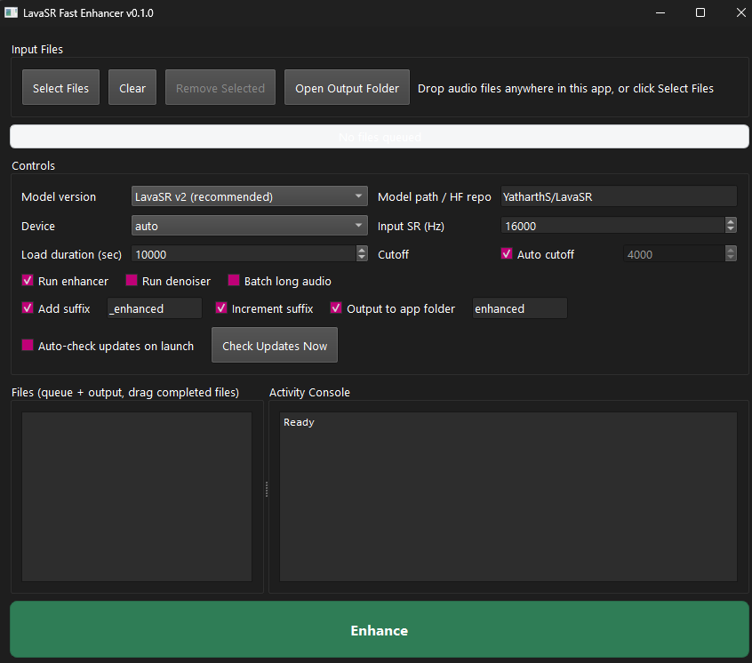

# LavaSR Fast Enhancer

Fast Windows desktop app for enhancing audio with [LavaSR](https://github.com/ysharma3501/LavaSR).



## What Users Need To Know

- Drag/drop or select multiple audio files
- Click `Enhance` (click again to cancel current batch)
- Drag completed files directly into DAWs/folders/apps
- Optional auto-update check on app launch (OFF by default)

## Install (Users)

### Option A: Installer (recommended)

1. Download the latest `LavaSR-Fast-Enhancer-Setup-*.exe` from Releases.
2. Run installer.
3. Launch **LavaSR Fast Enhancer** from Start Menu or desktop shortcut.

### Option B: Run from source

```powershell
py -3 -m venv .venv
.venv\Scripts\Activate.ps1
python -m pip install --upgrade pip
python -m pip install -r requirements.txt
python .\lavasr_gui.py
```

## How To Use

1. Add files:
   - Drop files anywhere in the app, or
   - Click `Select Files`
2. Configure controls (optional):
   - Denoise
   - Suffix naming
   - Increment suffix
   - Output folder + folder name
3. Click `Enhance`.
4. When files show `Done: ...`, drag them out from the list.

## Auto Update

- `Auto-check updates on launch` toggle is available in Controls.
- Default is **off**.
- When enabled, app checks GitHub Releases on startup and prompts to install a newer version.
- `Check Updates Now` button is available for manual checks.

Update source is configured by `app_config.json`:

```json
{
  "github_repo": "faxlab/LavaSR-Fast-Enhancer",
  "release_asset_keyword": "setup"
}
```

## Keyboard Shortcuts

- `Ctrl+O`: Select files
- `Delete`: Remove selected queued file rows
- `Ctrl+L`: Clear queue
- `Ctrl+Enter`: Enhance / Cancel

## Build Windows `.exe` Installer (Maintainers)

Prereqs:

- Python 3.10+
- Inno Setup 6 (`ISCC.exe` available)

Build command:

```powershell
.\release\build_installer.ps1
```

If Inno Setup is not installed, the script now completes a portable build and exits successfully.
Use strict mode to require installer packaging:

```powershell
.\release\build_installer.ps1 -RequireInstaller
```

Installer output (`release/out/LavaSR-Fast-Enhancer-Setup-<version>.exe`) is created only when Inno Setup is installed.

If you want the window to stay open on errors, use:

```powershell
.\release\build_installer.bat
```

`build_installer.bat` also prompts to install Inno Setup automatically (via `winget`/`choco`) when it is missing.

Portable-only build (skip installer packaging):

```powershell
.\release\build_installer.ps1 -PortableOnly
```

Output:

- `release/out/LavaSR-Fast-Enhancer-Setup-<version>.exe`

## GitHub Release Automation

- Workflow: `.github/workflows/release.yml`
- Triggers:
  - Manual (`workflow_dispatch`)
  - Tag push (`v*`)
- It builds installer on Windows and publishes it to GitHub Releases.

## Versioning

- App version is defined in `lavasr_gui.py` as `APP_VERSION`.
- For release tags, use `v<same-version>` (for example `v1.0.0`).

## Legal And Licensing

- Project license: [LICENSE](LICENSE) (MIT)
- Third-party notices: [THIRD_PARTY_NOTICES.md](THIRD_PARTY_NOTICES.md)
- This application bundles and relies on third-party open-source components; comply with their respective licenses when redistributing.
